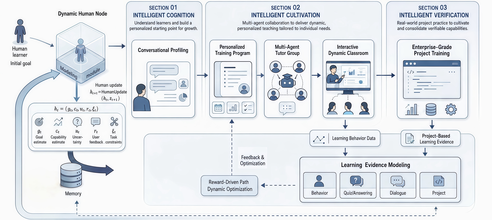
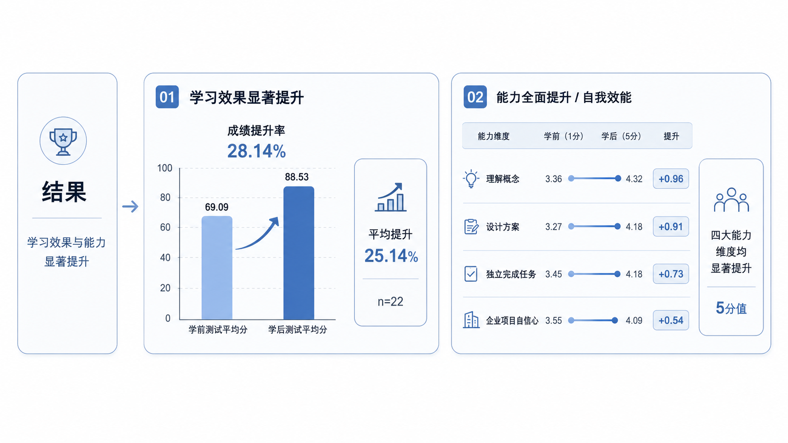
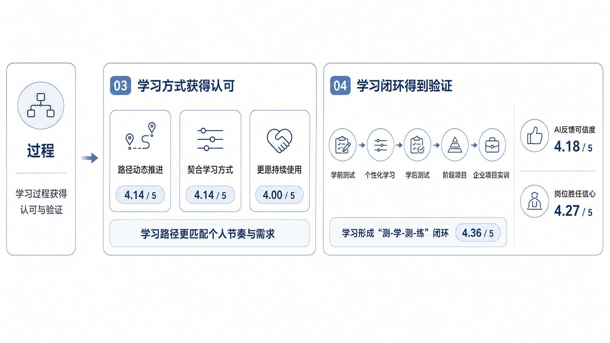
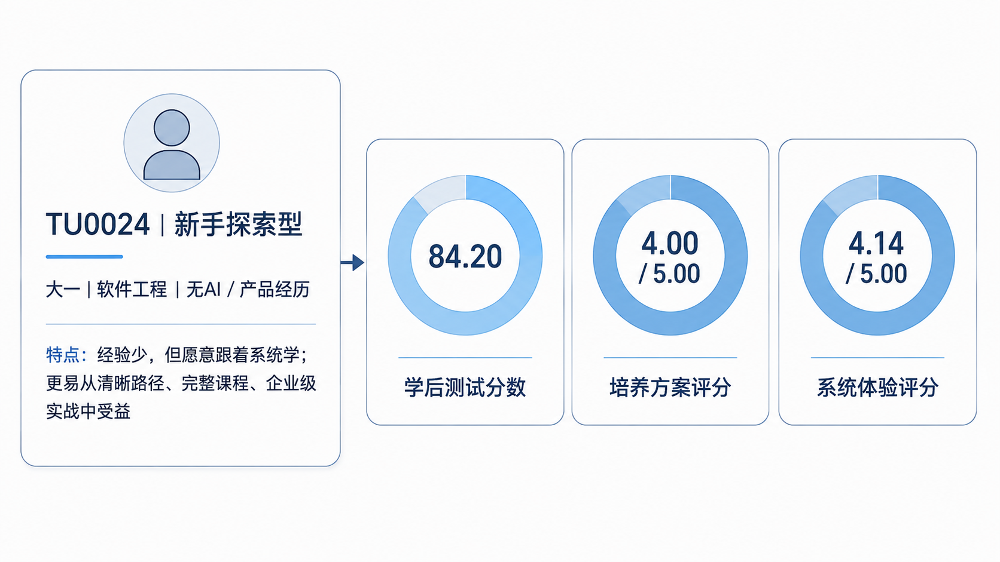
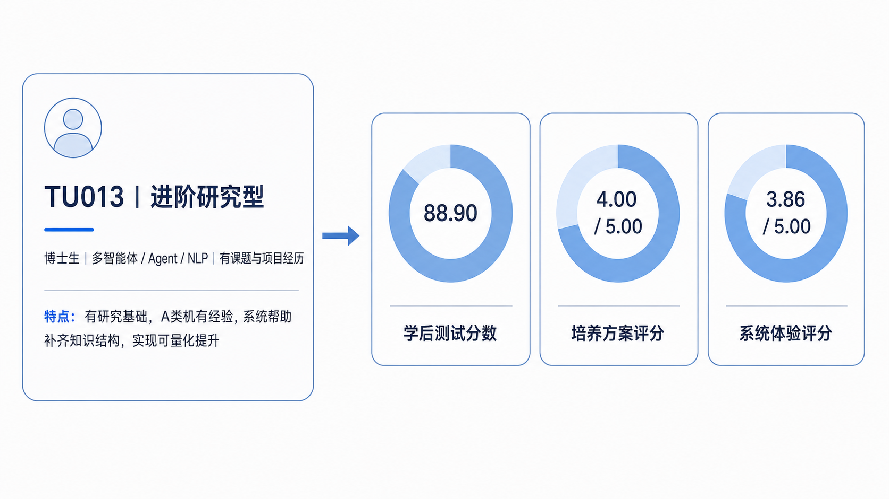
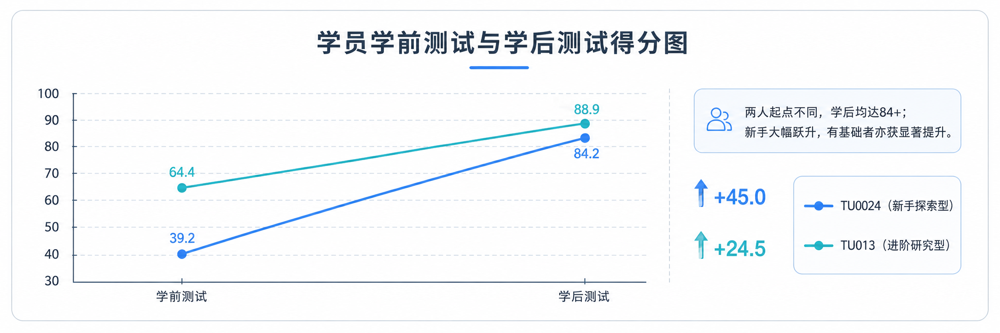

  
  <h1> 图灵学社 TuringUnion</h1>
  
<strong>One Learner, One University.</strong>

  

    
    
    
    
    
    
    
    
    
  

  

    <a href="#english">English</a> | <a href="#中文">中文</a>
  

<video src="https://github.com/ffcosmos/TuringUnion/raw/refs/heads/main/videos/图灵大学宣传片.MOV" autoplay muted loop playsinline controls preload="auto" width="100%"></video>

---

## What's New

- **2026-07-18**: TuringUnion will be released at WAIC.

---

中文

### 项目概述

图灵学社是一个面向 AI 时代个性化教育的多智能体自治教育引擎。系统以“一人一大学”为目标，通过学习者画像、路径规划、多智能体导师协同、动态课堂生成和企业级项目实训，构建可反馈、可调整、可沉淀的个性化培养闭环。

系统关注的核心问题是传统教育中的结构性限制：

- 教学方式单一
- 师生资源不均衡
- 课程体系固化
- 学习与实践脱节

这些限制共同导致传统教育难以同时满足：

- 个性强
- 效率高
- 规模化

图灵学社的设计目标，是将学习者从适应固定课程体系的角色，转变为由系统围绕其目标、基础、节奏和实践表现动态组织学习资源的中心节点。

### 系统目标

图灵学社围绕三个目标构建：

- 持续理解学习者：通过多轮对话和学习行为采集，建立动态学习者画像。
- 动态组织培养过程：根据画像和学习证据生成并调整学习路径、导师配置和课堂内容。
- 验证真实能力：通过企业级项目、代码评审和过程证据沉淀，形成可信能力凭证。

系统中的每一次对话、答题、练习、项目提交和反馈都会进入学习证据体系，并用于后续路径优化、导师调度和能力评估。下面的核心模块对应这一培养链路中的主要能力。

### 系统框架

图灵学社采用“智能认知—智能培养—智能验证”的三段式框架。系统首先将学习者目标、能力、反馈和任务约束建模为动态人类节点，再通过个性化培养方案、多智能体导师团和交互式动态课堂组织学习过程，最后以企业级项目实训和学习证据建模验证真实能力，并将结果反馈给路径优化模块。

  

### 核心模块

#### 对话式画像建模

画像建模是系统的入口模块。校长智能体通过多轮对话识别学习者的职业目标、知识基础、能力短板和学习偏好。该画像会随着学习行为和反馈持续更新，形成动态学习者模型。

#### 个性化培养方案

系统基于学习者画像生成阶段化学习路径。以“Agent 开发工程师”为例，路径可以被拆解为多个阶段和节点，覆盖基础知识、工具使用、工程实践和项目交付等能力。路径支持动态调整：学习进展快时可压缩路径，关键节点受阻时可补强相关内容。

#### 多智能体导师团

导师团由多个职责不同的智能体组成。系统根据当前学习任务和学习者状态进行调度，让不同智能体分别处理讲解、实践指导、答疑、反馈、评估和支持任务。该机制用于缓解传统教学中导师资源不足和响应不及时的问题。

#### 交互式动态课堂

动态课堂根据学习者的实时提问和互动生成教学内容。学习者可以在学习过程中随时打断、追问或改变关注点，系统会围绕当前问题重新组织讲解。

该模块由自研教学智能体 TeachMaster 支撑。TeachMaster 面向课程生产流程，覆盖课纲规划、内容编排、动画生成、语音讲解等环节。目前 TeachMaster 已累计讲授 5 万分钟，覆盖 42 个一级学科、437 个二级学科；每门课成本约 1600 元，约为传统录制课程成本的百分之一。

#### 企业级项目实训

企业级项目实训用于连接学习过程与真实产业需求。系统可接入下游企业项目需求，学习者在在线工程环境中完成开发任务，系统对代码和项目交付进行自动评审。项目结果会沉淀为可信能力凭证，可作为学习者面向企业展示的项目履历。

### 功能示意视频

#### 对话式画像建模 / Conversational Learner Profiling

<video src="https://github.com/ffcosmos/TuringUnion/raw/refs/heads/main/videos/user-profile-modeling.mp4" autoplay muted loop playsinline controls preload="auto" width="100%"></video>

#### 个性化培养方案 / Personalized Cultivation Plan

<video src="https://github.com/ffcosmos/TuringUnion/raw/refs/heads/main/videos/personalized-path.mp4" autoplay muted loop playsinline controls preload="auto" width="100%"></video>

#### 多智能体导师团 / Multi-Agent Mentor Team

<video src="https://github.com/ffcosmos/TuringUnion/raw/refs/heads/main/videos/multi-agent-mentors.mp4" autoplay muted loop playsinline controls preload="auto" width="100%"></video>

#### 交互式动态课堂 / Interactive Dynamic Classroom

<video src="https://github.com/ffcosmos/TuringUnion/raw/refs/heads/main/videos/dynamic-classroom.mp4" autoplay muted loop playsinline controls preload="auto" width="100%"></video>

#### 企业级项目实训 / Enterprise-Level Project Training

<video src="https://github.com/ffcosmos/TuringUnion/raw/refs/heads/main/videos/enterprise-project.mp4" autoplay muted loop playsinline controls preload="auto" width="100%"></video>

### 数据验证

参与者：22 名本硕博学习者，具备一定 AI 学习背景，但普遍缺乏产品分析经验，并以成长为多智能体产品分析师为学习目标。

图灵学社已完成一轮真实用户测试。测试覆盖 22 位学习者，包含本科、硕士、博士不同学习阶段。

#### 学习结果

  

初步结果显示：

- 平均成绩提升 25.14%
- 理解概念、方案设计、独立完成任务、企业项目信心四个能力维度均有提升
- 路径匹配度、AI 反馈可信度和就业准备度信心的用户评分均超过 4 分

#### 过程验证

  

测试验证了“测—学—测—练”的学习闭环：系统可以基于测试和学习行为持续调整路径，并将学习过程沉淀为可追踪的成长记录。

### 案例研究

#### 新手探索型学员

TU0024 代表缺少 AI 和产品经验、但具备持续学习意愿的新手学习者。系统从清晰路径、完整课程和企业级实践切入，帮助其建立基础能力并完成阶段性提升。

  

#### 进阶研究型学员

TU013 代表具备研究基础和 AI 项目经验的进阶学习者。系统围绕其研究目标补齐知识结构，并通过多智能体协作和量化评估支持更深入的实践。

  

#### 学员对比结果

两类学习者的起点不同，但学习后成绩均达到 84 分以上；新手学员提升 45.0 分，进阶学员提升 24.5 分，说明系统能够根据不同基础提供有效的个性化培养。

  

### 应用价值

图灵学社面向个性化人才培养、AI 教育平台、企业人才培训和就业能力认证等场景。系统将课程学习、导师支持、项目实践和能力验证连接为一条完整的学习链路，旨在提供更具适应性的培养过程，并让产业相关方更容易理解和使用学习者的能力成果。

---

## 贡献者

图灵学社由 AgentUniversity 核心团队及多智能体教育、个性化学习路径、TeachMaster 和企业级项目实训方向的协作者共同构建。

欢迎通过 issue 和 pull request 参与社区贡献。以下名单会随 GitHub 贡献持续更新：

<table>
  <tr>
    <td align="center">
      <a href="https://github.com/fanjingru">
        
         <b>Jingru Fan</b>
      </a>
    </td>
    <td align="center">
      <a href="https://github.com/ffcosmos">
        
         <b>ffcosmos</b>
      </a>
    </td>
  </tr>
</table>

- [GitHub Contributors](https://github.com/ffcosmos/AgentUniversity/graphs/contributors)
- [Issues](https://github.com/ffcosmos/AgentUniversity/issues)

## 联系我们

- 校园：<https://turingu.cn/campus>
- GitHub：<https://github.com/ffcosmos/AgentUniversity>
- Issues：<https://github.com/ffcosmos/AgentUniversity/issues>
- 邮箱：即将开放。

---

### Overview

TuringUnion is a multi-agent autonomous education engine for personalized learning in the AI era. It follows the principle of “one learner, one university” and builds a personalized cultivation loop through learner profiling, path planning, multi-agent mentoring, dynamic classroom generation, and enterprise-level project training.

The system addresses four structural limitations in traditional education:

- Limited teaching formats
- Uneven teacher-student resources
- Rigid curriculum structures
- Weak connection between learning and practice

These limitations make it difficult for traditional education to achieve the following goals at the same time:

- Strong personalization
- High efficiency
- Scalability

TuringUnion is designed to move the learner from adapting to a fixed curriculum into a central position where goals, prior knowledge, learning rhythm, and practice performance dynamically organize the learning resources around them.

### System Goals

TuringUnion is built around three goals:

- Continuously understand learners through multi-turn dialogue and learning behavior collection.
- Dynamically organize cultivation through learner profiles, learning evidence, path generation, mentor scheduling, and classroom generation.
- Validate real capability through enterprise-level projects, code review, and structured evidence accumulation.

Every conversation, answer, exercise, project submission, and feedback signal enters the learning evidence system and informs subsequent path optimization, mentor routing, and capability evaluation. The core modules below describe the main capabilities in this cultivation pipeline.

### Framework

TuringUnion follows a three-stage framework: intelligent cognition, intelligent cultivation, and intelligent verification. The system first models learner goals, capability estimates, feedback, and task constraints as a dynamic human node. It then organizes learning through personalized cultivation plans, multi-agent mentor teams, and interactive dynamic classrooms, and finally validates real capability through enterprise-grade project training and learning evidence modeling.

  

### Core Modules

#### Conversational Learner Profiling

Learner profiling is the entry module of the system. The President Agent uses multi-turn dialogue to identify career goals, prior knowledge, capability gaps, and learning preferences. The profile evolves with learning behavior and feedback, forming a dynamic learner model.

#### Personalized Cultivation Plan

The system generates staged learning paths from learner profiles. For example, an “Agent development engineer” path can be decomposed into multiple stages and nodes covering foundational knowledge, tool use, engineering practice, and project delivery. The path supports dynamic adjustment: it can compress when progress is fast and reinforce content when the learner is blocked at key nodes.

#### Multi-Agent Mentor Team

The mentor team consists of agents with different responsibilities. The system routes tasks according to the current learning objective and learner state, allowing different agents to handle explanation, practice guidance, Q&A, feedback, assessment, and support. This mechanism addresses the shortage and delayed response of mentor resources in traditional teaching.

#### Interactive Dynamic Classroom

The dynamic classroom generates teaching content from real-time learner interaction. Learners can interrupt, ask follow-up questions, or change focus during learning, and the system reorganizes the explanation around the current question.

This module is supported by TeachMaster, a self-developed teaching agent for course production workflows. TeachMaster covers syllabus planning, content organization, animation generation, voice explanation, and related processes. It has delivered 50,000 minutes of teaching, covering 42 first-level disciplines and 437 second-level disciplines. The cost per course is about RMB 1,600, roughly one percent of the cost of traditional recorded courses.

#### Enterprise-Level Project Training

Enterprise-level project training connects learning with real industry needs. The system can integrate downstream enterprise project requirements. Learners complete development tasks in an online engineering environment, and the system automatically reviews code and project deliverables. The project results become trustworthy capability credentials and enterprise-facing project experience.

### Demo Videos

#### Conversational Learner Profiling

<video src="https://github.com/ffcosmos/TuringUnion/raw/refs/heads/main/videos/user-profile-modeling.mp4" autoplay muted loop playsinline controls preload="auto" width="100%"></video>

#### Personalized Cultivation Plan

<video src="https://github.com/ffcosmos/TuringUnion/raw/refs/heads/main/videos/personalized-path.mp4" autoplay muted loop playsinline controls preload="auto" width="100%"></video>

#### Multi-Agent Mentor Team

<video src="https://github.com/ffcosmos/TuringUnion/raw/refs/heads/main/videos/multi-agent-mentors.mp4" autoplay muted loop playsinline controls preload="auto" width="100%"></video>

#### Interactive Dynamic Classroom

<video src="https://github.com/ffcosmos/TuringUnion/raw/refs/heads/main/videos/dynamic-classroom.mp4" autoplay muted loop playsinline controls preload="auto" width="100%"></video>

#### Enterprise-Level Project Training

<video src="https://github.com/ffcosmos/TuringUnion/raw/refs/heads/main/videos/enterprise-project.mp4" autoplay muted loop playsinline controls preload="auto" width="100%"></video>

### Evaluation

Participants: 22 undergraduate, master’s, and doctoral learners with some AI learning background but generally limited product analysis experience. Their learning goal was to grow into multi-agent product analysts.

TuringUnion has completed an initial real-user test with 22 learners across undergraduate, master’s, and doctoral stages.

#### Learning Outcome

  

Preliminary results show:

- Average score improvement of 25.14%
- Improvement across concept understanding, solution design, independent task completion, and enterprise project confidence
- User ratings above 4 points for path matching, AI feedback credibility, and job readiness confidence

#### Process Validation

  

The test provides initial validation for the “test—learn—test—practice” loop. The system can adjust learning paths based on testing and learning behavior, while accumulating traceable growth records.

### Case Studies

#### Beginner Exploration Profile

TU0024 represents a beginner learner with limited AI and product experience but strong willingness to learn. TuringUnion starts with a clear path, structured courses, and enterprise-level practice to build foundational capability and deliver measurable progress.

  

#### Advanced Research Profile

TU013 represents an advanced learner with research foundations and prior AI project experience. TuringUnion fills knowledge gaps around the learner’s research goals and supports deeper practice through multi-agent collaboration and quantitative evaluation.

  

#### Cross-Case Comparison

The two learners started from different baselines, yet both reached scores above 84 after learning. The beginner learner improved by 45.0 points, while the advanced learner improved by 24.5 points, indicating that the system adapts cultivation to different learner profiles.

  

### Application Value

TuringUnion targets personalized talent cultivation, AI education platforms, enterprise talent training, and job capability certification. The system connects course learning, mentor support, project practice, and capability validation into one learning pipeline, aiming to provide learners with more adaptive cultivation and make capability outcomes easier for industry stakeholders to understand and use.

---

## Contributors

TuringUnion is built by the AgentUniversity core team and collaborators working on multi-agent education, personalized learning paths, TeachMaster, and enterprise-level project training.

Community contributions are welcome through issues and pull requests. The public contributor list will be maintained through GitHub:

<table>
  <tr>
    <td align="center">
      <a href="https://github.com/fanjingru">
        
         <b>Jingru Fan</b>
      </a>
    </td>
    <td align="center">
      <a href="https://github.com/ffcosmos">
        
         <b>ffcosmos</b>
      </a>
    </td>
  </tr>
</table>

- [GitHub Contributors](https://github.com/ffcosmos/AgentUniversity/graphs/contributors)
- [Issues](https://github.com/ffcosmos/AgentUniversity/issues)

## Contact

- Campus: <https://turingu.cn/campus>
- GitHub: <https://github.com/ffcosmos/AgentUniversity>
- Issues: <https://github.com/ffcosmos/AgentUniversity/issues>
- Email: Coming soon.
